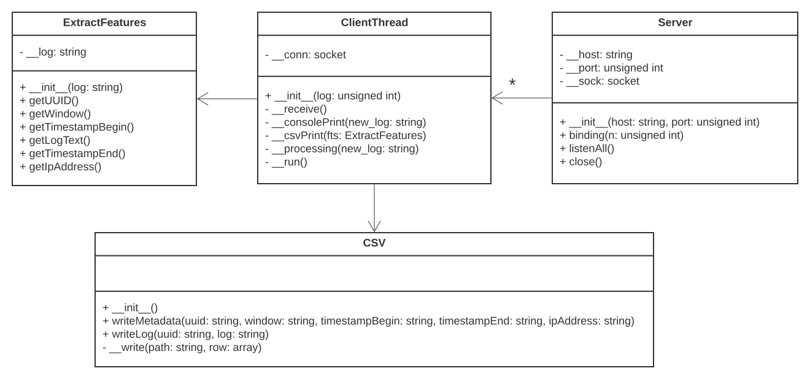
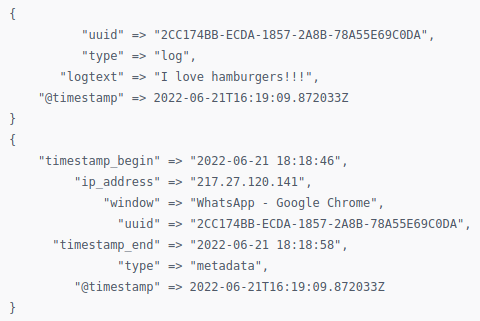
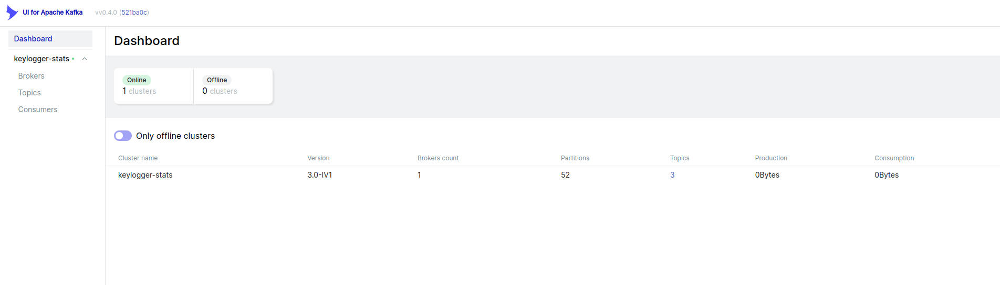
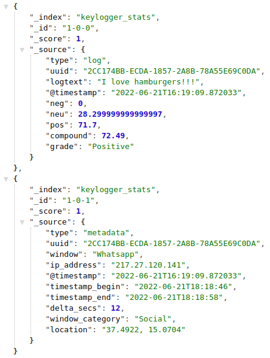
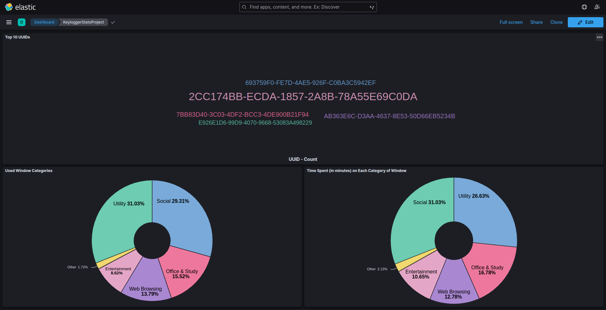
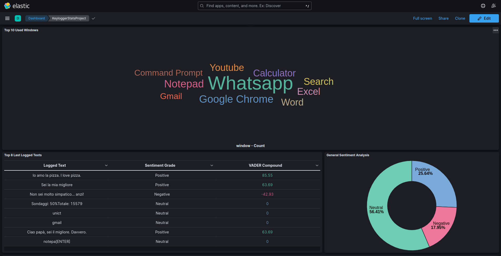
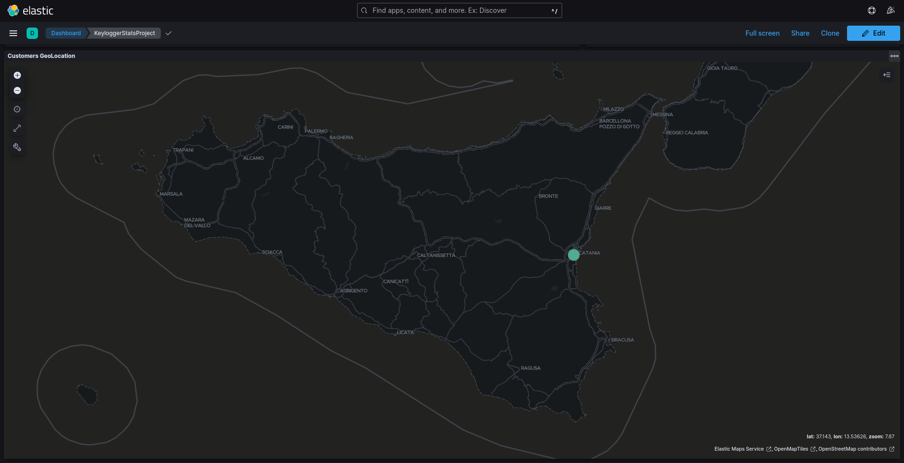
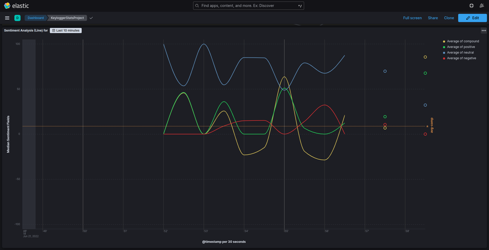

# System-Stats-By-Keylogger
_Project of Technologies for Advanced Programming_

_Grade: 30 with honors / 30_

_Antonio Scardace_ @ 
_Dept of Math and Computer Science, University of Catania_

## Introduction

The course aims to study and use useful technologies to build end-to-end solutions to analyze, manage, archive, process, and view a high amount of data in real-time. For instance, we have seen: Docker containers, and pipelines built with Logstash (for data ingestion), Kafka (for data streaming), Spark (for data processing), ElasticSearch (for data storing), and Kibana (for data visualization). 

This project was created as an exam project, to test and practice the following skills:
* Knowledge of Docker
* Knowledge of Data Ingestion via Logstash
* Knowledge of Data Streaming via Kafka
* Knowledge of Data Processing via Spark 
* Knowledge of Data Storing via Elasticsearch
* Knowledge of Data Visualization via Kibana
* Knowledge of Jupyter Notebook (for the presentation)
* Good coding skills (legible, reliable, documented, etc.) :computer:

## Real Use Case

The aim of the project is to make stats on the real-time use of the system by the user (and by users in general).

It can be useful as:
1. System Monitor owned by **Operating Systems** owners
2. System Monitor for **Public Offices Computers**
3. System Monitor for **Prison Computers**
4. **Parental Control**
5. **Spyware**

### Data Source: Windows Keylogger

The data source is a Windows Keylogger for Italian keyboards only, developed in C++14 using Windows APIs. Sends a log to the TCP server on each foreground window change OR after 1 minute of user inactivity.

The log has the following pattern:
```
[UUID] :: [Window Title] :: [Timestamp Start]
Logged Text...
[Timestamp End] :: [IP Address]
```

Each log is composed by:
- **UUID**: Identifies the PC univocally. Has the following format: xxxxxxxx-xxxx-xxxx-xxxx-xxxxxxxxxxxx.
- **Window Title**: Is the title of the window where the user has typed.
- **Timestamp Start**: Indicates when the user started typing in that window.
- **Logged Text**: Is the set of keys pressed by the user and logged by the keylogger.
- **Timestamp End**: Indicates when the user finished typing in that window.
- **IP Address**: Is the public IP address. If the PC has no connection, the default value is "Unknown".

For instance:
```
[154A9DC6-FF4E-4149-B81C-610AE7BBD151] :: [WhatsApp] :: [2022-01-01 12:00:00]
Hi Nicole, happy new year!!
[2022-01-01 12:00:13] :: [1.2.3.4]
```

### Server System

Receives logs (from multiple clients) and passes them to the pipeline illustrated below:
<p align="center">  </p>

The following functions are available for each user (personal stats) and for all users (general stats):
- For Logged Text:
    + Top 8 Last Logged Texts :page_facing_up:
    + Sentiment analysis :chart_with_upwards_trend:
- For Metadata:
    + Top 10 most used applications :bookmark:
    + Used windows classification :bar_chart:
        * Social
        * Utility
        * Entertainment
        * Web Browsing
        * Office & Study
        * Other
    + Customers Geolocation by IP :earth_americas:
    + Different stats about time spent writing to the PC :eyes:

## Structure & Demo

Let's see the structure of the project and how I have used all the components. <br/>
Each component used in this project has been put inside a **Docker Container** :whale:

Component | Description
------ | -------
 | I have used it to implement a multi-threading server that receives real-time logs via TCP requests on the 8800 port from multiple clients. It extracts the features seen above from the logs and saves them in two CSV files: <br/><br/> **metadata.csv** = [UUID, Window Title, Timestamp of Begin, Timestamp of End, IP Address] <br/> **logs.csv** = [UUID, Logged Text] <br/><br/><p align="center"></p>
 | I have used **Logstash** to create two different data flow: one for the metadata and one for the text logs. Logstash takes this input data from two files, metadata.csv and logs.csv - they have been shared with the server container via a Docker volume. <br/><br/> Here is an example of what Logstash receives: <br/><br/> <p align="center">  </p>
 | I have used **Apache Kafka** to make a single cluster, which has two topics: one for logs and one for metadata. It receives two different dataflows by Logstash and stores them to be pulled by Spark. **Kafka Stream** has not been used. <br/><br/> <p align="center">   </p>
 | I have created two Docker Containers - one for each Kafka Topic we need to read from. Each of them, after the processing, saves the documents into the Elasticsearch index _keylogger_. <br/> In the first, **Spark Streaming** read data from the _logs_ topic and adds a little set of features. It is the VADER dictionary. <br/> In the second, **Spark Streaming** read data from the _metadata_ topic and adds three features: the type of the window, the difference (in seconds) between the two timestamps fields, and the public IP address geolocation coordinates (if it isn't set to "Unknown"). <br/>
 | I have used **Elasticsearch** to create a cluster, containing the *keylogger_stats* index, shared only by a single node: *es001*. It receives docs from Spark Streaming. Data are saved into a Docker Volume to make the application persistent in time. <br/><br/> Here is an example of what Elasticsearch contains and shows: <br/><br/> <p align="center">  </p>
 | I have used **Kibana** to visualize some stats in real-time - I have set the dashboard auto-refresh to happen every second. The dashboard analyzes just the data that have arrived in the last 24 hours. It shows general data (of all PCs) and if the user clicks on a specific UUID, the dashboard shows data of that particular PC. <br/><br/>     

## Getting Started

So that the repository is successfully cloned and project run smoothly, a few steps need to be followed.

### Requisites

* At least 12 GB of RAM.
* At least 25 GB of free space.
* Use of Linux, MacOS, or Windows WSL.
* Need to download and install [Docker](https://docs.docker.com/get-docker/) (but the use of [Docker Desktop](https://www.docker.com/products/docker-desktop/) is optional).
* The use of [Visual Studio Code](https://code.visualstudio.com/download) is strongly recommended.

### Installation and Use

```sh
   $ git clone https://github.com/ElephanZ/System-Stats-By-Keylogger.git
   $ cd YOUR_PATH/System-Stats-By-Keylogger/
   $ bash run.sh
``` 

### Useful Links

Container | URL | Description
----- | ------- | -------
broker | http://localhost:8080 | UI for Kafka
elasticsearch | http://localhost:9200 | ElasticSearch basic URL
elasticsearch | http://localhost:9200/keylogger_stats/_search | ElasticSearch index URL
elasticsearch | [http://localhost:9200/keylogger_stats/_search?...](http://localhost:9200/keylogger_stats/_search?source_content_type=application/json&source={%22query%22:{%22match%22:{%22type%22:%22log%22}}}) | ElasticSearch URL to get all logs
elasticsearch | [http://localhost:9200/keylogger_stats/_search?...](http://localhost:9200/keylogger_stats/_search?source_content_type=application/json&source={%22query%22:{%22match%22:{%22type%22:%22metadata%22}}}) | ElasticSearch URL to get all metadata
kibana | http://localhost:5601 | Kibana basic URL
kibana | [http://localhost:5601/dashboards/list?...](http://localhost:5601/app/dashboards#/list?_g=(filters:!(),refreshInterval:(pause:!f,value:1000),time:(from:now-24h%2Fh,to:now))) | Kibana Dashboards List

## License :copyright: 

**Author**: [Antonio Scardace](https://antonioscardace.altervista.org/). <br/>
Distributed under the **GNU General Public License v3.0**. See ``` LICENSE ``` for more information.

PLEASE USE AND READ IT FOR ACADEMIC PURPOSES ONLY. :bangbang: <br/>
I DISCLAIM ANY LIABILITY FOR ILLEGAL USE. :bangbang:
